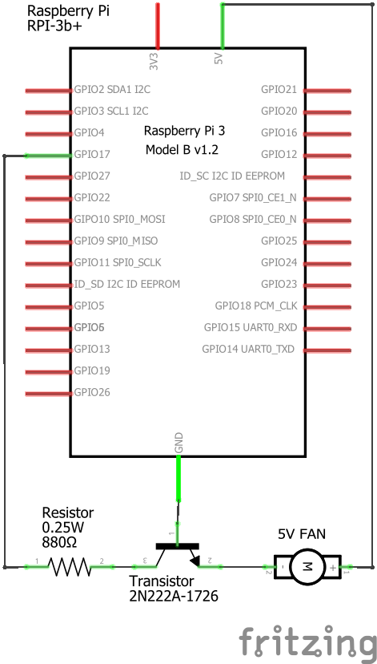

# 🌀 Raspberry Pi Fan Controller Installer

A Bash-based installer for a Python-powered fan controller on Raspberry Pi, designed for Debian-based systems (e.g. Raspberry Pi OS). It sets up a systemd service to automatically manage your fan based on CPU temperature.

## 📦 Features

- Installs a lightweight Python script to control a GPIO-connected fan  
- Automatically starts the fan controller using systemd  
- Monitors CPU temperature and toggles fan based on thresholds  
- Logs installation output to `/var/log/pi_fancontroller.log`  
- Includes a clean uninstall option  

## 🛠️ Requirements

- Raspberry Pi running a Debian-based OS (e.g. Raspberry Pi OS)  
- GPIO-connected fan (default GPIO pin: 17)  
  **NOTE: Do NOT connect the fan directly to the GPIO pins — a transistor circuit must be used**  
- Python 3 installed  
- `gpiozero` Python library (installed automatically if missing)  
- Must be run as root (use `sudo`)  

## 🔧 Circuit Diagram

The fan is controlled via GPIO17 using a transistor switch. This protects the Raspberry Pi and allows it to safely drive the fan.

### 🧩 Circuit Components

- **Raspberry Pi 3 Model B+**  
- **GPIO 17**: Controls the fan via transistor  
- **2N2222A NPN Transistor**: Acts as a switch  
- **880Ω Resistor**: Limits current to the transistor's base  
- **5V Fan**: Powered from the Pi's 5V rail  
- **Ground (GND)**: Shared by all components  

### ⚙️ How It Works

- When **GPIO17 is HIGH**, the transistor turns ON, grounding the fan and allowing it to spin.  
- When **GPIO17 is LOW**, the transistor turns OFF, and the fan is disconnected from ground.  
- The Python script reads CPU temperature and toggles GPIO17 accordingly.

## 🚀 Installation
Make new file on your Raspberry Pi:
*nano pi_fancontrol.sh*
Copy and paste the contents of: 
https://github.com/SilentWoof/Scripts/tree/main/shell_scripts/pi_fancontrol/pi_fancontrol.sh
into the new file.
Make the file execuutable:
*sudo chmod +x pi_fancontrol.sh*
Run the installer:
*sudo ./pi_fancontrol.sh*

## 🗑️ Uninstall
The script contains an uninstaller. To run it use --uninstall:
*sudo pi_fancontrol.sh --uninstall*